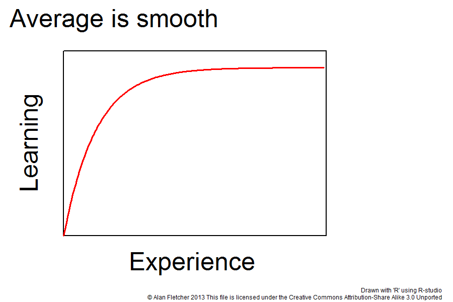

# introduction

# why comunication is important

You don't have sales without communication. And sales is fundamental for all businesses.

The line above is hardly arguable, even though plenty of technical people try to. Some of the most common arguments you hear are:

- You need technical knowledge to build the product
  -> and you need to sell it to convince someone to use it.

- Good products sells by itself
  -> They may increase retention and the odds of getting referals from your current clients, yes. But if you don't do a good job marketing it you may be too slow

Sales is also at the heart of your personal career. You're selling yourself when you write a resume/cover letter to get a new job. You're selling yourself when you're trying to convince your manager to promote you. If you have a great idea for your job, and you're convinced it will work, you have to convince others about it.

So whether you're working for someone else or you're a business owner, you're constantly selling something as long as you're dealing with people!

And if sales is fundamental for your career or business, communication is fundamental for sales.

# specifically, why writing is crucial

There are hardly any people in the world who can come up with an arbitrary subject they neve heard about and give a polished speech about it. That's not how sales work (not the good sales at least)

Have you ever felt like a person giving a lecture is the smartest person on that subject? Have you ever wondered how is it possible that someone can just come up and give an hour long lecture about a super specific subject?

Well that doesn't happen overnight. The methodology changes from person to person, depending on the person itself, how important a speech is and how much previous knowledge the person has about the subject at hand. But at some level, there's always some sort of planning in advance, that often comes up in writing.

So writing is crucial for communication. It is an essential skill to promote yourself, to scale your voice to the world (literally) and to turn you in a better speaker - which has all sorts of other positive side effects.

# in the context of software development

Often times the outside world thinks that software development is about talking with a machine through code.

While that is true at some level, developing a software is mostly about communicating with people.

Making code easier to maintain is more important than making code more performant

Software development has many activities that are unrelated to code. But when it comes to actual coding, there's three main activities: reading code, debugging code and writing code.

Debugging code is hard. Reading is even harder. Writing is the easy part.

You will spend most of your coding sessions reading or debuggin code rather than writing it. So you want to optmize the code for these two activites rather than being faster.

On top of that, computers are so powerful nowadays that, even if you do have opportunity to optmize your code, there's a huge change the clients aren't going to notice anyway.

And you know what's the best way of making code easier to understand? Comments and documentation.

I've read several times the argument "good code documents itself". While that has a little bit of truth in it, I say you should never bet on it.

When you create a mental map of what your application should do, the code will seem crystal clear for you eyes. But you can't bet that will hold true for the next guy - or you two weeks from now.

Yes you should name your variables and functions properly to make it easier to understand the code itself. But nothing will ever beat documenting your code with comments/documents in plain >insert your language of work here<.

Doing a good job not only guarantees the next person will know exactly what the function/procedure/API/whatever is supposed to do but also has no impact in the performance of your application, as your build is more likely to strip out the comments anyway.

# conclusion

In a world with 280 character messages and 60 second elevator pitches, it's hard to argue against the importance of communication as a skill.

I know a grant total of 0 people who would say communication is **not** an important skill. If you do your math, I bet you will land at the very same total that I have.

Which makes sense. In a world of tweeting and stuffed email boxes, being able to communicate precisely what you want in a clear and concise manner is **crucial**, and surprisingly hard. And although most people know this, very few people actually go out of their way to improve their communication skills.

I'm guilty of this, too.

That's one of my main drivers for this blog, actually.

Even though I have a very good vocabulary, I am not the best I could be when explaining my ideas with words. So by creating this blog and making it a routine to write regularly, I hope to bridge this gap.

## Why you should start writing

Writing is a skill like any other. Take, for example, playing guitar.

Can you improve by watching other people play? Of course.

Is that enough to become a great guitar player? **Hell no!**

That definitely helps. But to become good at playing guitar you have to, above all else, practice. To become a good writer you have to write.

And the more you do, the better you'll get. So if you want to become a good writer, you should just start writing. Just do it. Even if you don't publish it, that's ok.

## The benefits

Before going into the benefits, I want to show the image below about **Learning Curves** followed by the explanation - both extracted from [wikipedia.org](https://en.wikipedia.org/wiki/Learning_curve)

> A learning curve is a graphical representation of how an increase in learning (measured on the vertical axis) comes from greater experience (the horizontal axis); or how the more someone (or something) performs a task, the better they get at it

This graph shows that you improve **a lot** faster at any given skill the less you know about it. Body builders even have a dedicated term for it - **noob gains**.

But let's go back to the guitar example from before. If you never touched a guitar in your life, you'll think that someone that spent a reasonable amount of time practicing it, let's say 200 hours, a lot better than they actually are. You might not be able to tell the difference between someone with 200 hours of practice and 1000 hours of practice - or even at a pro level, depending on the complexity of the song.

Now when you see someone with 10 hours of practice, you can definitely tell this person just started learning. That's because this person is not too far ahead of you. _The farther the person is at a given skill, the harder it is for you to gauge how good that person actually is_ in relation to other people.

As I say this, you might claim:

### But every one writes, all the time. Texting, email, tweeting... The list is endless!

But almost anyone is actually going out of their way to actually **improve** their writing. That consists of, to name a few examples:

- Spotting grammar mistakes on your own writing;
- Making a concious effort to write properly - without spelling mistakes and with correct punctuation;
- Review what you wrote before submitting it;
- Asking for feedback for other people about your writing.

So this means that you don't need to write several books to become good at writing. You just need to practice and make a concious effort to improve it for a little bit, and you will be way ahead of the majority of people out there.

This is great for several reasons, which I'll talk about in another post.

In the meantime, start writing!
